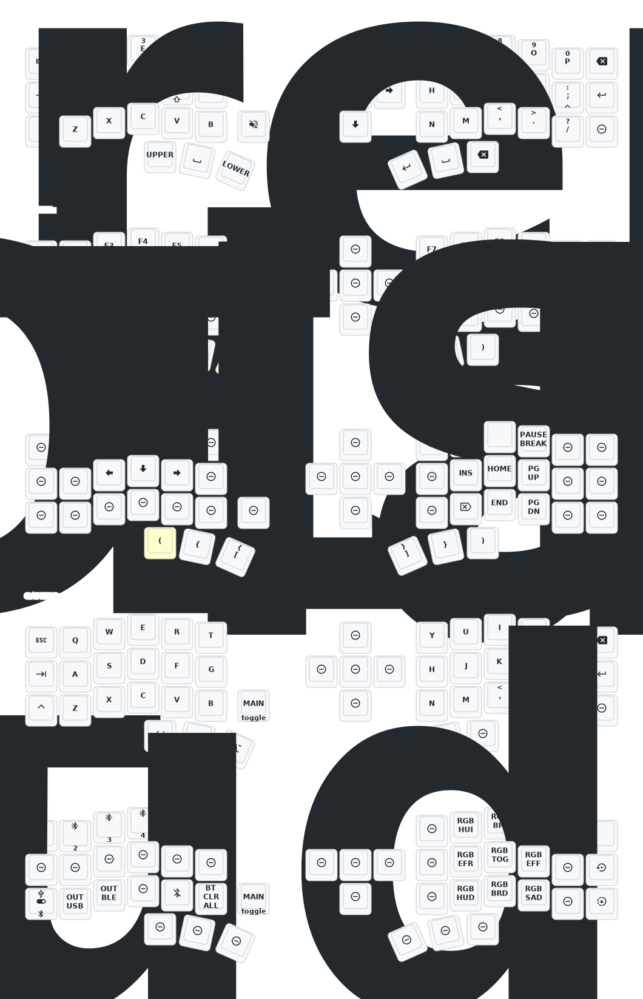

# Corne Keymap



# Custom Image Instructions

- Define your 1-bit art (68x140).
- Rotate it 90º clockwise
- Transform the image in a [LVGL Image Converter](https://lvgl.github.io/lv_img_conv/)
  - Customize your filename (optional)
  - Color Format: `CF_INDEXED_1BIT`
  - Output Format: `C array`
  - Optiones: `none`
- Open your transformed image `<filename>.c` and copy the bitmap array
- Open `./config/boards/shields/nice_view_custom/widgets/art.c` and paste the content replacing one of the existing image arrays
- Make sure it follows the following structure

  ```c
  #ifndef LV_ATTRIBUTE_[FILENAME]
  #define LV_ATTRIBUTE_[FILENAME]
  #endif

  const LV_ATTRIBUTE_MEM_ALIGN LV_ATTRIBUTE_LARGE_CONST LV_ATTRIBUTE_[FILENAME] uint8_t [FILENAME]_map[] = {
  #if CONFIG_NICE_VIEW_WIDGET_INVERTED
          0xff, 0xff, 0xff, 0xff, /*Color of index 0*/
          0x00, 0x00, 0x00, 0xff, /*Color of index 1*/
  #else
          0x00, 0x00, 0x00, 0xff, /*Color of index 0*/
          0xff, 0xff, 0xff, 0xff, /*Color of index 1*/
  #endif

    0xfd, 0x54, 0x15, 0x15, 0x19, 0x55, 0x51, 0x11, 0x15, 0x11, 0x11, 0x11,
    # ...  REST OF THE BITMAP IMAGE ARRAY
    0xc8, 0xa8, 0x08, 0x88, 0x0a, 0xaa, 0xaa, 0xaa, 0xaa, 0xaa, 0xa8, 0xa3,
  };

    const lv_img_dsc_t [FILENAME] = {
    .header.cf = LV_IMG_CF_INDEXED_1BIT,
    .header.always_zero = 0,
    .header.reserved = 0,
    .header.w = 140,
    .header.h = 68,
    .data_size = 1232,
    .data = [FILENAME]_map,
  };
  ```

- Just in case you added a new image (not replacing an existing one), make sure you also added `[FILENAME]` filename into `./config/boards/shields/nice_view_custom/widgets/peripheral_status.c` liek this

  ```c
  LV_IMG_DECLARE([FILENAME]);

  const lv_img_dsc_t *anim_imgs[] = {
      # ... OTHER IMAGES DEFINITIONS
      &[FILENAME],
  }
  ```

### Resources

- [Original Instructions on Reddit](https://www.reddit.com/r/ErgoMechKeyboards/comments/15t3o6k/custom_art_on_niceview_displays/)
- [Bitmap Converter](https://29a.ch/ditherlicious/)
